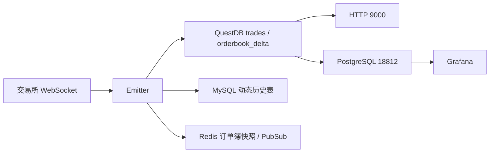

# DataSynchronizer 数据读取指南（面向工程 AI）

本文是本仓库的数据地图。需要分析、导出或回测行情数据时，优先读取 QuestDB，不要扫描或直接解析 QuestDB 的磁盘文件。

## 1. 快速决策

| 需求 | 数据源 | 读取入口 |
| --- | --- | --- |
| 历史逐笔成交 | QuestDB 每市场 `*_trades` | 先查 `market_data_catalog`，再通过 HTTP `localhost:9000` 或 PostgreSQL 协议 `localhost:18812` 读取 |
| 历史订单簿变化/重建 | QuestDB 每市场 `*_orderbook_delta` | 先查 `market_data_catalog`，从最近的 `snapshot` 起按序应用 `delta` |
| 旧版逐交易对成交、K 线、订单簿快照 | MySQL | 使用 `.env` 中的 `MYSQL_*` / `MYSQL_*_EXCHANGE` 配置 |
| 当前订单簿短期快照和实时通知 | Redis | 使用 `.env` 中的 `REDIS_*` 配置；它不是长期历史库 |
| 可视化查看 | Grafana | `http://localhost:3000` |
| 手工 SQL | QuestDB Web Console | `http://localhost:9000` |

默认原则：

1. 新的高频历史行情读取任务使用 QuestDB。
2. 通过 SQL、HTTP API 或 PostgreSQL wire protocol 读取，不要直接读取 `db` 目录中的内部文件。
3. 查询必须先从 `market_data_catalog` 解析目标市场表，再限制时间范围。
4. 时间范围不明确时，先执行元数据/范围查询，不要直接全表导出。

## 2. QuestDB 连接与物理位置

应用写入配置来自 `.env`：

```env
QUESTDB_HOST=localhost
QUESTDB_PROTOCOL=tcp
QUESTDB_PORT=9009
QUESTDB_SQL_PORT=18812
```

端口用途：

| 端口 | 协议 | 用途 |
| --- | --- | --- |
| `9000` | HTTP | Web Console、REST 查询、ILP over HTTP 写入 |
| `18812` | PostgreSQL wire | Docker 宿主机端口；映射到容器内 `8812`，供 SQL 客户端、Grafana、`psql`、Python/Node 驱动使用 |
| `9009` | ILP TCP | InfluxDB Line Protocol 写入，不是首选读取接口 |

Grafana 已配置为通过 PostgreSQL 协议访问 `host.docker.internal:18812`，数据库为 `qdb`，默认本地开发账号见 `grafana/provisioning/datasources/questdb.yml`。

### 当前 Windows 实例

截至 2026-07-19，本机正在运行的 QuestDB 数据根目录为：

```text
D:\Program Files\questdb-9.4.3-rt-windows-x86-64\bin\qdbroot
```

当时总占用约 `5.15 GB`，主要目录为 `orderbook_delta~14`。目录名中的 `~数字` 是 QuestDB 内部表目录版本，不等于 SQL 表名；SQL 中仍使用 `orderbook_delta`。

物理路径取决于启动方式，不能仅凭仓库中的目录判断当前活动实例：

| 启动方式 | 数据位置 |
| --- | --- |
| `start-questdb.bat` / `questdb.exe start` | QuestDB 安装目录下的默认 `qdbroot`（当前活动实例属于此情况） |
| `start-questdb.ps1` | 默认显式指定为 `D:\QuestDBData`，可通过 `-DataDir` 修改 |
| `docker compose up -d questdb` | Docker 命名卷 `questdb_data`，容器内为 `/var/lib/questdb` |
| 仓库根目录 `qdbroot/` | 仅是一份本地目录；当前 Compose 和启动脚本均未把它声明为活动数据目录 |

判断实际数据位置时，应查看当前进程的启动参数或启动脚本。即使知道物理目录，也只通过数据库接口读取。

## 3. QuestDB 表结构

QuestDB 表由 ILP 首次写入时自动创建。以下类型来自当前写入实现 `src/questdb/index.ts`。

> ILP `.at(...)` 自动创建的 designated timestamp 列为 `timestamp`。历史文档曾将其写成 `ts`；查询前仍应使用 `table_columns()` 核验活动实例。

### `{market}_trades`：逐笔成交

每一行是一笔标准化后的公开市场成交。

| 字段 | QuestDB 类型 | 含义 |
| --- | --- | --- |
| `timestamp` | `TIMESTAMP` | 交易所成交时间；写入端输入 Unix 毫秒，QuestDB 查询结果按时间戳表示 |
| `exchange` | `SYMBOL` | 小写交易所 ID，如 `binance`、`kucoin` |
| `symbol` | `SYMBOL` | CCXT 统一交易对，如 `BTC/USDT` |
| `side` | `SYMBOL` | `buy` 或 `sell` |
| `price` | `DOUBLE` | 成交价格 |
| `quantity` | `DOUBLE` | 基础资产成交数量 |
| `trade_id` | `STRING` | 交易所成交 ID；不要假定它可转换为数值 |

注意：QuestDB 写入路径没有显式去重。读取方需要去重时，可按业务语义使用 `(exchange, symbol, trade_id)`；不要只按 `ts` 去重，同一毫秒可能有多笔成交。

### `{market}_orderbook_delta`：订单簿档位增量

每一行表示一个价格档位在该次持久化中的状态。一次持久化通常产生多行，且这些行共享同一个 `timestamp` 和 `sequence`。写入节奏由 `ORDERBOOK_PERSIST_INTERVAL_MS` 控制（默认 1000ms），完整快照间隔由 `ORDERBOOK_FULL_SNAPSHOT_INTERVAL_MS` 控制（默认 60000ms）。

| 字段 | QuestDB 类型 | 含义 |
| --- | --- | --- |
| `timestamp` | `TIMESTAMP` | 消息时间；写入端输入 Unix 毫秒 |
| `exchange` | `SYMBOL` | 小写交易所 ID |
| `symbol` | `SYMBOL` | CCXT 统一交易对，如 `BTC/USDT` |
| `side` | `SYMBOL` | `ask`（卖盘）或 `bid`（买盘） |
| `update_type` | `SYMBOL` | `snapshot` 或 `delta` |
| `price` | `DOUBLE` | 价格档位 |
| `qty` | `DOUBLE` | 该档位更新后的数量；`0` 表示删除该档位 |
| `sequence` | `DOUBLE` | 交易所/CCXT 序列号；不可用时为 `0` |
| `source_update_count` | `DOUBLE` | 该间隔内合并的上游 WebSocket 更新次数 |

读取语义：

- `snapshot` 是服务启动或重新订阅后的完整订单簿，每个价格档位一行。
- `delta` 是后续变化，`qty > 0` 表示设置/替换该价格档位数量，`qty = 0` 表示删除。
- `sequence` 被存为 `DOUBLE`，超大整数可能失去精度；值为 `0` 时不能依赖它排序。
- 同一毫秒内可能有多次更新。仅按 `timestamp` 排序未必能恢复严格事件顺序；有可靠非零序列号时同时按 `sequence` 排序。
- 重建历史订单簿时，从目标时刻之前最近的一组 `snapshot` 开始，按时间和可用序列依次应用 `delta`。不要把所有历史行直接视为当前挂单。
- 增量由本地前后两帧的 top-N 比较得出，深度上限为 `CCXT_ORDERBOOK_DEPTH`（可按交易所用 `CCXT_ORDERBOOK_DEPTH_{EXCHANGE}` 覆盖）。档位进出该边界会表现为新增或删除，不代表交易所侧真实撤单。

### `market_data_catalog`：市场路由

每个 exchange-symbol 市场对应一张成交表和一张订单簿表。读取最新路由：

```sql
SELECT exchange, symbol, trades_table, orderbook_delta_table
FROM market_data_catalog
LATEST ON timestamp PARTITION BY exchange, symbol;
```

表名显式包含市场类型：现货使用 `_spot`，CCXT `BASE/QUOTE:SETTLE` 格式的永续/掉期使用 `_swap`，例如 `binance_btc_usdt_spot_trades` 和 `gate_btc_usdt_swap_orderbook_delta`。表名不使用哈希，必须从 catalog 或仓库的严格命名函数获得，不能把任意外部文本直接拼进 SQL。

旧统一表 `trades` 和 `orderbook_delta` 仅保留历史数据且切换后只读；新数据不回填、不双写。查询跨越切换时间时，需要分别读取旧统一表和新市场分表。

### 3.1 只读质量审计

审计脚本只执行 `SELECT`，不会修改或删除数据。它自动识别 MySQL 动态表，并通过 QuestDB `market_data_catalog` 发现和检查所有当前市场分表：

```powershell
python -m pip install -r scripts/requirements-data-quality.txt
python scripts/audit_market_data.py
```

报告写入 `reports/data-quality/`，同时生成 JSON 和 CSV。发现失败项或数据库连接错误时退出码为 `1`，warning 不导致失败。可用以下参数单独审计一侧：

```powershell
python scripts/audit_market_data.py --skip-questdb
python scripts/audit_market_data.py --skip-mysql
```

MySQL 连接读取 `.env` 中两套 `MYSQL_*` 配置；QuestDB SQL 读取可选的 `QUESTDB_SQL_HOST`、`QUESTDB_SQL_PORT`、`QUESTDB_SQL_USER`、`QUESTDB_SQL_PASSWORD` 和 `QUESTDB_SQL_DATABASE`，默认使用 `127.0.0.1:18812/admin/quest/qdb`。

### 3.2 指定时间窗清洗与成交修复

`scripts/reconcile_market_data.py` 按 UTC 时间窗对账 CCXT 与 QuestDB 成交，同时审计 MySQL 遗留表，并把 QuestDB 订单簿分为可信、可疑和不可恢复区间。默认模式是只读 dry-run：

```powershell
python scripts/reconcile_market_data.py `
  --start 2026-07-20T00:00:00Z `
  --end 2026-07-20T00:05:00Z `
  --exchange binance `
  --symbol BTC/USDT
```

只有 CCXT 分页能够证明目标区间完整，并且不存在成交 ID 内容冲突时，才允许显式写入 companion 表：

```powershell
python scripts/reconcile_market_data.py `
  --start 2026-07-20T00:00:00Z `
  --end 2026-07-20T00:05:00Z `
  --exchange binance `
  --symbol BTC/USDT `
  --apply
```

修复不会改写市场分表。成交写入统一的 `trades_repair_staging`，校验后提升到 `trades_repair`；订单簿质量区间写入统一的 `orderbook_quality_intervals`。DDL 和按市场查询模板见 `SQL/questdb_reconciliation.sql`。

订单簿缺口无法通过交易所接口回溯，因此处理原则是：

- `trusted`：从有效完整 snapshot 开始，序列与重放结果可信。
- `suspect`：序列缺失、为零或顺序存在歧义，保留但默认不作为严格回放数据。
- `unrecoverable`：存在序列缺口、倒退、非法帧或 crossed book；缺口后的 delta 不再套用到旧状态。
- 只有后续有效完整 snapshot 才能重新进入 `trusted`，不会插值或根据成交数据猜测挂单。

退出码为：`0` 无问题或修复成功，`1` dry-run 发现可修复项或可疑区间，`2` 参数错误，`3` 源不完整、订单簿不可恢复或成交冲突，`4` 网络、数据库或报告运行错误。报告写入 `reports/data-reconciliation/`。

## 4. 最小查询流程

### 4.1 先发现数据

```sql
-- 查看用户表
SELECT * FROM tables();

-- 发现每个市场对应的两张表
SELECT exchange, symbol, trades_table, orderbook_delta_table
FROM market_data_catalog
LATEST ON timestamp PARTITION BY exchange, symbol;

-- 查看实际字段和类型，自动建表环境中以此结果为准
SELECT * FROM table_columns('binance_btc_usdt_spot_trades');
SELECT * FROM table_columns('binance_btc_usdt_spot_orderbook_delta');

-- 查看覆盖时间和行数
SELECT min(timestamp), max(timestamp), count() FROM "binance_btc_usdt_spot_trades";
SELECT min(timestamp), max(timestamp), count() FROM "binance_btc_usdt_spot_orderbook_delta";
```

### 4.2 读取逐笔成交

```sql
SELECT timestamp, exchange, symbol, side, price, quantity, trade_id
FROM "binance_btc_usdt_spot_trades"
WHERE timestamp IN '2026-07-19T00:00:00Z;2026-07-19T01:00:00Z'
ORDER BY timestamp
LIMIT 10000;
```

生成 1 分钟 K 线：

```sql
SELECT
  timestamp,
  first(price) AS open,
  max(price) AS high,
  min(price) AS low,
  last(price) AS close,
  sum(quantity) AS volume
FROM "binance_btc_usdt_spot_trades"
WHERE timestamp IN '2026-07-19T00:00:00Z;2026-07-19T01:00:00Z'
SAMPLE BY 1m ALIGN TO CALENDAR;
```

### 4.3 读取订单簿事件

```sql
SELECT timestamp, exchange, symbol, side, update_type, price, qty, sequence
FROM "binance_btc_usdt_spot_orderbook_delta"
WHERE timestamp IN '2026-07-19T00:00:00Z;2026-07-19T00:05:00Z'
ORDER BY timestamp, sequence
LIMIT 100000;
```

查看每个档位最后记录（适合检查最新状态，不替代严格的历史重放）：

```sql
SELECT *
FROM (
  SELECT *
  FROM "binance_btc_usdt_spot_orderbook_delta"
  LATEST ON timestamp PARTITION BY exchange, symbol, side, price
)
WHERE qty > 0;
```

### 4.4 通过 HTTP 直接读取

PowerShell 中获取 JSON：

```powershell
curl.exe --get --data-urlencode "query=SELECT * FROM binance_btc_usdt_spot_trades ORDER BY timestamp DESC LIMIT 10" http://localhost:9000/exec
```

导出 CSV：

```powershell
curl.exe --get --data-urlencode "query=SELECT * FROM binance_btc_usdt_spot_trades WHERE timestamp IN '2026-07-19T00:00:00Z;2026-07-19T01:00:00Z' ORDER BY timestamp" http://localhost:9000/exp --output trades.csv
```

程序化读取大量数据时优先使用 PostgreSQL 协议并采用流式/分批读取；HTTP `/exec` 更适合元数据和小结果集，`/exp` 适合受限范围的 CSV 导出。

## 5. MySQL 兼容数据

本项目仍会把部分数据同步写入 MySQL。连接信息以 `.env` 为准：

- `MYSQL_*`：基础数据库，保存市场、交易对、ticker、策略等通用数据。
- `MYSQL_*_EXCHANGE`：交易所历史数据库，保存按交易所和交易对拆分的动态表。

不要把 `.env` 中的密码写入报告、脚本或提示词。`SQL/install.sql` 中的历史默认库名与 `.env.example` 可能不同，运行时以 `.env` 为准。

动态表命名会移除交易对中的 `/`、`-`、`_` 并转为小写：

```text
{exchange}_{cleanSymbol}_trades
{exchange}_{cleanSymbol}_orderbook
{exchange}_{cleanSymbol}_{interval}
```

例如 `binance` + `BTC/USDT`：

```text
binance_btcusdt_trades
binance_btcusdt_orderbook
binance_btcusdt_1m
```

MySQL 动态表格式：

| 表类别 | 主要字段 | 时间格式 |
| --- | --- | --- |
| `*_trades` | `time`, `side`, `quantity`, `price`, `tradeId` | `time` 为 Unix 毫秒 `BIGINT` |
| `*_orderbook` | `time`, `orderbook` | `time` 为 Unix 毫秒；`orderbook` 是 JSON 文本，包含 `asks`/`bids` 二维数组 |
| `*_{interval}` | `time`, `open`, `high`, `low`, `close`, `volume` | `time` 为 Unix 毫秒 |

基础库主要静态表及定义见 `SQL/install.sql`，包括 `market_datas`、`price_tickers`、`tradepairs`、策略和情绪数据。读取前使用 `SHOW TABLES` 与 `DESCRIBE table_name` 核对实际部署结构。

## 6. Redis 数据

Redis 用于运行时状态和发布订阅，不适合历史分析：

- 订单簿快照 key 使用与 MySQL 相同的 `{exchange}_{cleanSymbol}_orderbook` 命名。
- 快照值是 JSON，主体包含 `asks` 和 `bids`，每个档位通常为 `[price, quantity]`。
- 快照 TTL 为 `600` 秒。
- `OrderBookUpdate` Pub/Sub 消息格式为：

```json
{
  "exchange": "binance",
  "symbol": "BTCUSDT",
  "ask": 118000.1,
  "bid": 118000.0
}
```

这里的 Pub/Sub `symbol` 来自交易所原始标识，可能是 `BTCUSDT`；QuestDB 中的 `symbol` 已转换为 CCXT 统一格式 `BTC/USDT`。跨源关联时必须先标准化交易对。

## 7. 给工程 AI 的执行检查表

1. 检查 `localhost:9000` 是否可用，并用 `tables()` 发现实际表。
2. 用 `table_columns()` 验证字段，不假定自动创建的表与文档永远完全一致。
3. 用 `min(ts)`、`max(ts)`、`count()` 和 `GROUP BY exchange, symbol` 确认数据范围。
4. 明确使用 UTC 时间，并在 SQL 中提供开始和结束时间。
5. 对 `orderbook_delta` 同时限制交易所、交易对和较短时间窗口。
6. 订单簿分析明确区分“最后档位状态”和“从快照开始严格重放”。
7. 导出前先执行同条件的 `count()`，避免意外读取数十亿行。
8. 不直接读取、复制、重命名或修改 QuestDB 活动 `qdbroot/db` 内的文件。

## 8. 数据链路与代码依据



关键实现位置：

- QuestDB 字段与写入：`src/questdb/index.ts`
- 成交双写逻辑：`src/emitter/events/trades_emitter.ts`
- 订单簿增量、快照与 Redis：`src/emitter/events/orderbook_emitter.ts`
- MySQL 动态表结构：`src/database/queries/enums.ts`
- MySQL 动态表命名：`src/utils/index.ts`
- 基础 MySQL 表定义：`SQL/install.sql`
- QuestDB/Grafana 容器配置：`docker-compose.yml`
- Grafana QuestDB 数据源：`grafana/provisioning/datasources/questdb.yml`
